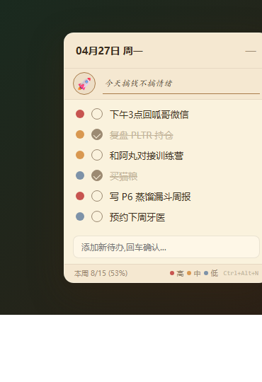

# 🌤 Daily Todo · 桌面便签

> **极简羊皮纸风格的 Windows 桌面待办便签 · 数据用 Markdown 存 · 完美兼容 Obsidian**

每天早上贴在屏幕右上角，写一句口号、选一个心情 emoji、列三件要做的事——晚上看一眼勾掉，跨天自动归档。所有数据是普通的 `.md` 文件，可以丢进 Obsidian / VSCode / 任何编辑器搜索查阅。

<p align="center">
  <a href="https://github.com/liboxia587/desktop-daily-todo/releases/latest"></a>
  <a href="https://github.com/liboxia587/desktop-daily-todo/stargazers"></a>
  <a href="https://github.com/liboxia587"></a>
</p>

> 🎯 **完全小白用法**：[点这里下载 EXE](https://github.com/liboxia587/desktop-daily-todo/releases/latest) → 双击运行 → 桌面右上角立刻出现便签
> 🛠 **开发者用法**：见下方 [快速开始](#-快速开始) 章节

---

## 📸 截图

<p align="center">
  
</p>

---

## ✨ 核心功能

| | |
|---|---|
| 📅 按天记录 | 每天一个 `YYYY-MM-DD.md` 文件，跨天自动归档 |
| 🚀 心情抬头 | 每天选一个 emoji + 写一句口号（卡通字型） |
| 🎯 三档优先级 | 红 / 琥珀 / 灰蓝（莫兰迪降饱和） |
| ✅ 一键完成 | 左键点击划掉 / 右键删除 |
| 📆 历史回看 | 点顶部日期弹日历，看任意一天 |
| 🪟 无边框置顶 | 半透明 + 始终置顶 + 不抢焦点 |
| ⚡ 全局热键 | `Ctrl + Alt + N` 任何场景秒呼出 |
| 📌 系统托盘 | 关闭按钮最小化，不杀进程 |
| 💾 位置记忆 | 拖到哪下次还在哪 |

---

## 📦 数据格式

每天一个 `.md` 文件，frontmatter + checkbox 列表，**Obsidian / GitHub 直接渲染**：

```markdown
---
date: 2026-04-27
done: 2/4
mood: 🚀
slogan: "今天搞钱不搞情绪"
tags: [daily_todo]
---

- [x] 已完成的待办 #p/high
- [x] 复盘 PLTR 持仓 #p/mid
- [ ] 写本周周报 #p/high
- [ ] 预约下周牙医 #p/low
```

> Obsidian 用户：把 `data_dir` 指到你 vault 内某个文件夹，每天的 todo 自动加入知识库可搜索可双链。

---

## 🚀 快速开始

### 方式 A：从源码直跑（推荐，启动快）

```bash
git clone https://github.com/liboxia587/desktop-daily-todo.git
cd desktop-daily-todo
pip install -r requirements.txt
pythonw main.py
```

要无黑窗口后台运行：双击 `run_silent.vbs`

### 方式 B：打包成 .exe

```bash
pip install -r requirements.txt
pyinstaller build.spec --clean --noconfirm
```

打包后 `dist/DailyTodo.exe` 单文件可执行。

### 开机自启

双击 `install_quick.bat`（如果用方式 A）或 `install.bat`（如果用方式 B），自动在 `shell:startup` 创建快捷方式。

---

## ⚙️ 配置

首次运行自动生成 `config.json`：

```json
{
  "data_dir": "C:\\Users\\YourName\\daily_todo",
  "window_x": null,
  "window_y": null,
  "window_width": 280,
  "window_height": 460,
  "opacity": 0.92
}
```

| 字段 | 默认 | 说明 |
|---|---|---|
| `data_dir` | `~/daily_todo` | 待办文件存储路径 |
| `window_x` / `window_y` | `null` | 窗口位置（自动保存） |
| `window_width` / `window_height` | 280 × 460 | 窗口尺寸 |
| `opacity` | 0.92 | 透明度（0.0~1.0） |

---

## ⌨️ 快捷键

| 快捷键 | 功能 |
|---|---|
| `Ctrl + Alt + N` | 全局唤出窗口 + 焦点输入框 |
| `Enter`（输入框） | 添加新待办 |
| 左键点击条目 | 切换完成状态 |
| 右键点击条目 | 删除 |
| 点击优先级圆点 | 循环切换 红→琥珀→灰蓝 |
| 点击顶部日期 | 弹日历，看历史任意一天 |
| 点击 emoji 按钮 | 弹 4×4 网格选今日心情 |

---

## 🧱 技术栈

- Python 3.10+
- [PyQt6](https://pypi.org/project/PyQt6/) — UI 框架
- [pynput](https://pypi.org/project/pynput/) — 全局热键
- [PyInstaller](https://pypi.org/project/pyinstaller/) — 可选打包

---

## 📁 项目结构

```
desktop-daily-todo/
├── main.py            # 主入口
├── main_window.py     # UI（标题/心情条/列表/输入/底栏）
├── data_store.py      # Markdown 读写
├── config.py          # 配置管理
├── hotkey.py          # 全局热键
├── run_silent.vbs     # 无黑窗口启动器
├── install_quick.bat  # 一键开机自启（源码模式）
├── install.bat        # 一键开机自启（exe 模式）
├── uninstall.bat      # 移除开机自启
├── build.bat          # PyInstaller 打包脚本
├── build.spec         # PyInstaller 配置
├── preview.html       # 视觉预览（浏览器打开）
└── requirements.txt
```

---

## 🎨 视觉风格

**羊皮纸 v2 · 精致化**——米黄底 + 古铜强调 + 莫兰迪优先级 + 半透明圆角。

桌面常驻不刺眼，长时间盯着不疲劳。打开 `preview.html` 在浏览器看渲染效果。

---

## 🤝 贡献

欢迎 Issue / PR。改色板 / 加快捷键 / 加导出 / 翻译 i18n —— 任何想法都欢迎讨论。

---

## 📜 License

MIT © 2026 [Libo](https://github.com/liboxia587)

---

## 🙏 致谢

- 首版需求 brief 由 Claude Code 起草
- 首版代码由 [Manus](https://manus.im) 实现
- 视觉精致化 + 部署 + 心情抬头由 Claude Code 完成
- 数据格式设计灵感来自 [Obsidian](https://obsidian.md) 的 frontmatter

> *"用 AI 协作，把闪过的小念头做成能用的东西。"*

---

## 👋 来找 Libo

我是 **Libo** ([@liboxia587](https://github.com/liboxia587))，一个内容创业者 + 投资人 + AI 协作爱好者。

- 🚀 **GitHub**: [github.com/liboxia587](https://github.com/liboxia587) — 我的所有 vibe coding 作品都在这
- 📬 **联系**: 在仓库 [Issues](https://github.com/liboxia587/desktop-daily-todo/issues) 或 [Discussions](https://github.com/liboxia587/desktop-daily-todo/discussions) 找我

如果这个便签让你的桌面变好用了一点点，**点个 ⭐ Star 让我开心一下**——也方便其他人发现它。

🪄 **想要别的 vibe coding 小工具？** 关注 [我的 GitHub 主页](https://github.com/liboxia587)，新作品会陆续放出来。
